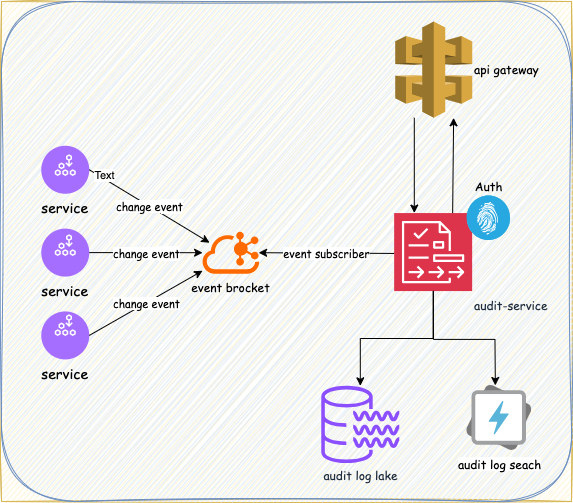

# audit-service

## Problem Statement
Implement Audit services for a microservices based application.

Audit service is independent distributed service that, as name suggests, helps in auditing the changes made by all the 
other services in their respective resources. Other services generates change notification for the every modify 
operations, acts as producer of the event. Audit service, on the other hand, subscribed to the change notifications, 
acts as a consumers and process the audit messages by writing them into the audit database for future auditing 
capabilities also provided by the audit service. User, based on what audit messages are authorized, can access audit 
service for appropriate audit messages.

### Functional Goal
1. The audit service should subscribe to change notifications from all other services, process and save them into a standard format in the database.
2. Should provide APIs to view audit message, consider two personas for viewing 
   1. Admin who can view all audit messages
   2. Non-admin who can view only for entities he/she has access to
3. Should enable audit log rotation with configurable window.

### Non-functional Goals
1. Format of the audit message
2. Database of choice and schema design with considerations around performance
3. Safeguard against audit tampering
4. Considerations for cross-platform deployment
5. Considerations for capable deployment
6. Develop this service as a Spring Application
7. Deploy as a war in tomcat on a CentOS virtual machine.

## High-level design
### audit service high level design diagram


---

### event broker
Audit Service is independent, highly distributed service that supports the handling of change notifications generated by
producer services. Producer services will generate the notifications into the message broker which audit services are 
subscribed to. There are a couple of options for message brokers to choose from as mentioned below.

<details>

### 📌 Pros & Cons Summary

#### **Apache Kafka** [selected for this implementation]
- ✅ Pros:
   - High throughput and scalability
   - Built-in durability and re-playability
   - Rich ecosystem (Kafka Streams, KSQL, Connect)
   - Mature in terms of Community, documentation, and long-term support
- ❌ Cons:
   - Operationally complex (ZooKeeper, partitions, brokers)
   - Overkill for simple or low-volume use cases

#### **Apache ActiveMQ**
- ✅ Pros:
   - Simple to set up with JMS support
   - Good for traditional enterprise Java applications
- ❌ Cons:
   - Lower throughput and feature growth compared to Kafka
   - Fewer modern integrations and declining popularity

#### **RabbitMQ**
- ✅ Pros:
   - Lightweight and easy to deploy
   - Excellent support for multiple protocols (AMQP, MQTT)
   - Good plugin ecosystem and UI management
- ❌ Cons:
   - Limited message replay features
   - Throughput lower than Kafka at scale

#### **AWS SQS**
- ✅ Pros:
   - Fully managed, scales automatically
   - No infrastructure or broker management
   - FIFO support and IAM integration
- ❌ Cons:
   - Not open-source or self-hostable
   - No message replay unless explicitly stored elsewhere

#### **ZeroMQ**
- ✅ Pros:
   - Extremely low latency
   - Brokerless and very lightweight
- ❌ Cons:
   - No durability, persistence, or broker management
   - Requires custom implementation for reliability and ordering
   - Not ideal for audit/compliance-grade systems

</details>

---

### audit database
audit database will hold audit logs to be queries later for audit purposes.

<details>


#### Available databases options 
1. Elastic search [selected to store data for short duration and real time search queries]
2. MongoDB [not selected]
3. PostgreSQL [selected to store data over longer duration and offline queries]
4. Amazon S3 + athena [not selected]
5. Amazon S3 + Glacier [not selected]

#### 📊 Audit Log Storage Selection Guide

| Use Case / Criteria                                   | Elasticsearch      | PostgreSQL         | MongoDB            | S3 + Athena        | S3 + Glacier       |
|-------------------------------------------------------|--------------------|--------------------|--------------------|--------------------|--------------------|
| 🔍 Fast full-text & field-based search (tokenized)    | ✅ Best suited      | ⚠️ Index-heavy      | ⚠️ Moderate         | ❌ Not supported    | ❌ Not supported    |
| 📈 High write throughput (real-time logs)             | ✅ Excellent        | ⚠️ Medium           | ✅ Good             | ⚠️ Needs batching   | ❌ Not applicable   |
| 📁 Flexible schema / nested fields                    | ✅ Good             | ❌ Rigid            | ✅ Excellent        | ✅ Handles JSON     | ✅ Handles JSON     |
| 📅 Long-term archival (months to years)               | ❌ Costly           | ⚠️ Medium (with care) | ⚠️ Costly at scale  | ✅ Cheap            | ✅ Cheapest         |
| 💸 Low-cost storage                                    | ❌ High             | ⚠️ Medium           | ⚠️ Medium           | ✅ Excellent        | ✅ Excellent        |
| 📊 Structured reporting & joins                       | ❌ Weak             | ✅ Best suited      | ⚠️ Limited          | ⚠️ Complex           | ❌ Not possible     |
| 🔐 Compliance (immutability, WORM, backups)           | ⚠️ Needs extensions | ⚠️ Needs WORM support | ⚠️ Needs control    | ✅ Versioned        | ✅ WORM by default  |
| 📉 Low query frequency (cold access only)             | ❌ Overkill         | ⚠️ Depends           | ⚠️ Depends          | ✅ Suited           | ✅ Best suited      |
| 🧠 Easy integration with Spring Boot                  | ✅ Spring Data      | ✅ Spring Data JPA  | ✅ Spring Data      | ⚠️ Via SDK/query layer | ❌ Not direct       |
| 🔄 Data retention, aging, and tiering support         | ✅ ILM policies     | ⚠️ Manual partition | ⚠️ Manual           | ✅ Lifecycle rules  | ✅ Auto-tiering     |

Legend:
✅ = Best suited  
⚠️ = Possible with limitations / added effort  
❌ = Not ideal or unsupported

</details>

---

### audit message format
audit messages are the once audit service receive from other services and write them into the audit database.

<details>


#### 📝 Audit Log Format Design Criteria

| Criterion                         | Description                                                                 | Importance                                                                 |
|----------------------------------|-----------------------------------------------------------------------------|---------------------------------------------------------------------------|
| 🔑 `eventId`                     | Unique identifier (UUID) for the audit event                                | Ensures traceability and de-duplication                                   |
| 🕒 `timestamp`                   | ISO 8601 formatted timestamp of when the event occurred                     | Critical for ordering and time-range queries                              |
| 📦 `sourceService`              | The microservice that generated the event (e.g., user-service)             | Enables filtering and attribution of actions                              |
| 🔁 `eventType`                  | Type of event (e.g., USER_CREATED, RESOURCE_DELETED)                        | Helps in classification, filtering, and analytics                         |
| 🧩 `entityType` & `entityId`    | What was changed (e.g., User, Order) and its ID                             | Core reference to the subject of the change                               |
| 👤 `changedBy`                  | Who made the change — includes username, userId, and roles                  | Enables authorization checks and access filtering                         |
| 🔄 `changeSummary`              | What changed — structured diff of old vs new values                         | Enables rich history views and auditing fidelity                          |
| 🌐 `metadata`                   | Optional context (IP address, user agent, etc.)                             | Useful for forensic, compliance, and security audit trails                |
| 🧠 Schema Flexibility           | Support for evolving message structure (e.g., nested, optional fields)     | Important for long-term maintainability and compatibility                 |
| 🔐 Tamper Evident (optional)    | Signature or hash of message for integrity validation                       | Optional but important for security-sensitive environments                |
| 💬 Extensibility                | Should support adding new fields (e.g., tags, severity) over time          | Future-proofing the schema                                                |
| 🔎 Searchable Field Types       | Field types chosen to support fast and useful searches (e.g., keywords, nested) | Directly impacts performance in Elasticsearch or other search DBs     |


```json
{
   "$schema": "http://json-schema.org/draft-07/schema#",
   "title": "AuditEvent",
   "type": "object",
   "properties": {
      "eventId": {
         "type": "string",
         "format": "uuid"
      },
      "timestamp": {
         "type": "string",
         "format": "date-time/ISO 8601"
      },
      "sourceService": {
         "type": "string"
      },
      "eventType": {
         "type": "string"
      },
      "entityType": {
         "type": "string"
      },
      "entityId": {
         "type": "string"
      },
      "changedBy": {
         "type": "object",
         "properties": {
            "username": { "type": "string" },
            "userId": { "type": "string" },
            "roles": {
               "type": "array",
               "items": { "type": "string" }
            }
         },
         "required": ["username", "userId", "roles"]
      },
      "changeSummary": {
         "type": "object",
         "additionalProperties": {
            "type": "object",
            "properties": {
               "old": { "type": ["string", "null"] },
               "new": { "type": ["string", "null"] }
            },
            "required": ["old", "new"]
         }
      },
      "metadata": {
         "type": "object",
         "properties": {
            "ipAddress": { "type": "string" },
            "userAgent": { "type": "string" }
         },
         "required": ["ipAddress", "userAgent"]
      }
   },
   "required": [
      "eventId",
      "timestamp",
      "sourceService",
      "eventType",
      "entityType",
      "entityId",
      "changedBy",
      "changeSummary",
      "metadata"
   ]
}

```

Example:
```json
{
   "eventId": "uuid",
   "timestamp": "ISO 8601",
   "sourceService": "user-service",
   "eventType": "USER_UPDATED",
   "entityType": "User",
   "entityId": "12345",
   "changedBy": {
      "username": "john.doe",
      "userId": "user-001",
      "roles": ["ADMIN"]
   },
   "changeSummary": {
      "email": {
         "old": "a@example.com",
         "new": "b@example.com"
      }
   },
   "metadata": {
      "ipAddress": "192.168.1.10",
      "userAgent": "Mozilla/5.0"
   }
}

```

another example:
```json
{
   "eventId": "6f8e67ad-8c47-4299-b054-7c87173babc5",
   "timestamp": "2025-05-01T17:00:00Z",
   "sourceService": "library-book-service",
   "eventType": "BOOK_STATUS_CHANGED",
   "entityType": "Book",
   "entityId": "book-456",
   "changedBy": {
      "username": "emma.watson",
      "userId": "staff-789",
      "roles": ["LIBRARIAN"]
   },
   "changeSummary": {
      "status": {
         "old": "available",
         "new": "checked_out"
      }
   },
   "metadata": {
      "ipAddress": "10.0.0.45",
      "userAgent": "Mozilla/5.0"
   }
}

```

elastic search index mapping:
```json
PUT /audit-logs
{
  "mappings": {
    "properties": {
      "eventId": {
        "type": "keyword"
      },
      "timestamp": {
        "type": "date"
      },
      "sourceService": {
        "type": "keyword"
      },
      "eventType": {
        "type": "keyword"
      },
      "entityType": {
        "type": "keyword"
      },
      "entityId": {
        "type": "keyword"
      },
      "changedBy": {
        "properties": {
          "username": { "type": "keyword" },
          "userId": { "type": "keyword" },
          "roles": { "type": "keyword" }
        }
      },
      "changeSummary": {
        "type": "object",
        "dynamic": true
      },
      "metadata": {
        "properties": {
          "ipAddress": { "type": "ip" },
          "userAgent": { "type": "text" }
        }
      }
    }
  }
}
```

</details>

---

### 🔐 [Audit Service API](audit_service_api_doc.md)

---

### Appendix

<details>

<summary> Message broker selection criteria comparison </summary>

| Criteria                | Meaning                                                                 | Kafka                        | ActiveMQ                    | RabbitMQ                   | AWS SQS                           | ZeroMQ                          |
|------------------------|-------------------------------------------------------------------------|------------------------------|-----------------------------|----------------------------|-----------------------------------|---------------------------------|
| **Durability**         | Ensures messages are not lost                                           | ✅ High (disk + replication) | ✅ Good (persistent queues) | ✅ Good (persistent queues) | ✅ Durable by default              | ❌ Minimal (no persistence)      |
| **Ordering**           | Maintains order of messages                                             | ✅ Per partition              | ⚠️ Limited                  | ⚠️ Fair                    | ✅ FIFO queues (optional)         | ⚠️ App must handle it           |
| **Replayability**      | Ability to reprocess past events                                        | ✅ Yes (offset-based)         | ❌ Not built-in             | ❌ Not built-in            | ❌ Not supported                  | ❌ Manual implementation needed |
| **Throughput**         | Volume of messages per second                                           | 🔥 Very high                  | ✅ Medium                   | ✅ Medium                  | ✅ Medium to high                 | 🔥 Extremely high               |
| **Delivery Guarantees**| Exactly-once, at-least-once delivery                                    | ✅ At-least-once (default)    | ✅ At-least-once            | ✅ At-least-once           | ✅ At-least-once or Exactly-once  | ❌ Fire-and-forget mostly       |
| **Latency**            | Time between send and receive                                           | ✅ Low                        | ✅ Low                      | ✅ Low                     | ✅ Low to medium                  | ⚡ Very low                     |
| **Ease of Operations** | Simplicity of setup and maintenance                                     | ⚠️ Complex (ZK required)      | ✅ Simple                   | ✅ Simple                  | ✅ Fully managed (serverless)     | ⚠️ DIY                          |
| **Cloud-native**       | Integrates natively with cloud environments                             | ⚠️ Needs extra setup          | ⚠️ Manual setup             | ⚠️ Manual setup            | ✅ Fully managed                  | ❌ Not cloud-native             |
| **Protocol Support**   | Communication protocol support                                          | Kafka protocol               | JMS, STOMP, OpenWire       | AMQP, MQTT, STOMP         | HTTPS + AWS SDK                  | Custom socket-based             |
| **Monitoring Tools**   | Built-in or ecosystem support for visibility                            | ✅ Rich ecosystem             | ✅ Basic tools              | ✅ Good (UI + plugins)     | ✅ CloudWatch + SDK               | ❌ None out of the box          |
| **Maturity**           | Community, documentation, and long-term support                         | ✅ Very mature                | ✅ Mature                   | ✅ Mature                  | ✅ Backed by AWS                  | ⚠️ Niche, low-level              |

</details>

<details>
<summary>what I would do different next time working on this project </summary>
1. Since we have to deploy the application on CentOS container with provided Tomcat, I would first develop a basic 
service version and work on deployment of that through CI/CD pipeline followed by the monitoring/actuator so that
while integrating with different data stores (ES, MinIO, AWSS3), I can also keep testing there health. 
adding functionality would come later once the basic app is ready and getting deployed through CI/CD. 
This way I can make consistent progress by adding required functionality.
</details>